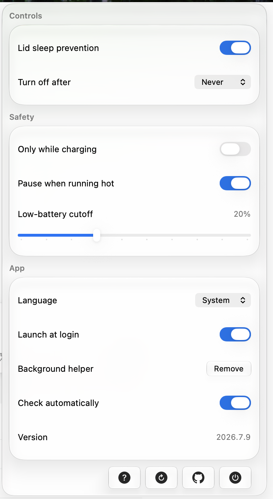

# Lidless

[](https://github.com/nghialuong/Lidless/releases)

A tiny macOS menu-bar app that keeps your Mac running **even with the lid closed** —
so coding agents (Claude Code, Codex, etc.) keep working while you move around.

> Open source under the [MIT License](LICENSE).

<p align="center">
  
</p>

## Features

- One-click **keep awake with the lid closed** (menu bar toggle).
- Privileged background **helper** (`SMAppService`) so toggling never asks for a password.
- **Watchdog**: if the app crashes or is force-quit, the helper auto-restores normal sleep — the Mac can't get stuck awake.
- **Safety guards**: pause when running hot, only-while-charging, and a low-battery cutoff.
- **Auto-off timer**: optionally turn keep-awake off after 15 min – 4 hours, with a live countdown.
- **Automatic updates** via [Sparkle](https://sparkle-project.org) — EdDSA-signed appcast, notarized DMGs.
- **Launch at login**, and a clean menu with battery/power status.

## How it works

macOS sleeps when you close the lid. The reliable way to override that on Apple Silicon
is the `SleepDisabled` flag in `IOPMrootDomain` (what `sudo pmset -a disablesleep 1` sets).
`caffeinate` does **not** prevent lid-close sleep — only this flag does.

The app talks to a root helper over XPC; the helper flips the flag with no admin prompt and
runs a heartbeat watchdog. If the app stops checking in (>90s), the helper restores sleep.

## Architecture

- **`Lidless`** — SwiftUI `MenuBarExtra` app (macOS 13+), not sandboxed, `LSUIElement`.
- **`LidlessHelper`** — root LaunchDaemon, registered via `SMAppService`, serves `LidlessHelperProtocol` over XPC. Embedded at `Contents/MacOS/LidlessHelper` with its plist in `Contents/Library/LaunchDaemons/`.
- **`Sources/Shared`** — pure, unit-tested logic: pmset parsers, watchdog, safety evaluator, settings.

## Build (no Xcode GUI needed)

Requires the Xcode command-line tools + [XcodeGen](https://github.com/yonaskolb/XcodeGen).

```bash
xcodegen generate
xcodebuild test -scheme Lidless-CI -destination 'platform=macOS' | xcbeautify
```

The `.xcodeproj` is gitignored — `project.yml` is the source of truth.

## App icon

The app icon and the menu-bar glyphs are committed assets under
`Resources/Assets.xcassets/` (`AppIcon.appiconset` plus the `MenubarLaptop` /
`MenubarLaptopActive` template imagesets that mark keep-awake off / on).

`scripts/make_iconset.sh` is kept as a helper for regenerating an icon set from a
single master if you want to swap the artwork:

```bash
bash scripts/make_iconset.sh   # renders icon + emits Assets.xcassets/AppIcon.appiconset
```

## Release

Signed + notarized DMG plus the EdDSA-signed Sparkle appcast (needs a Developer ID
cert, a notarytool keychain profile, and the Sparkle signing key in the keychain):

```bash
./scripts/release.sh   # archive → export → notarize → staple → DMG → appcast → publish
```

Publishes the DMG to a GitHub Release and writes the feed to `docs/appcast.xml`
(served at the `SUFeedURL` in `project.yml`).

## Milestones

- **M0** — spike, verified lid-closed on real Apple Silicon (`scripts/lidless.sh`). ✅
- **M1 / M1.5** — menu-bar app + privileged helper + XPC + watchdog. ✅
- **M2** — safety preferences (thermal / charging / battery) + persistence. ✅
- **App complete** — icon, launch-at-login, onboarding, About, release pipeline. ✅
- **Auto-update** — Sparkle with an EdDSA-signed appcast, shipped from `release.sh`. ✅
- **Later** — signed runtime verification on device.

## Safety

Running with the lid closed under heavy load can heat the machine and drain the battery.
Keep it plugged in and ventilated. The safety guards auto-pause on heat / low battery,
and a reboot always resets the underlying flag.

To report a security issue, see [SECURITY.md](SECURITY.md).

## License

[MIT](LICENSE) © 2026 Nghia Luong
